# Provisioning ROKS Cluster On TechZone

This document explains about Provisioning IBM RedHat Openshift Kubernetes Service (ROKS)
cluster on Techzone.

## 1. Login into Techzone

Login into techzone using the URL https://techzone.ibm.com/

## 2. Choose ROKS Cluster

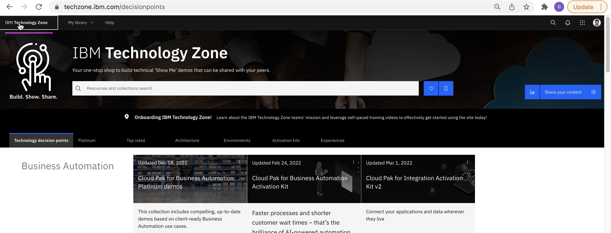
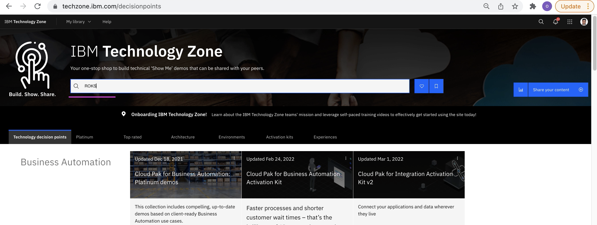
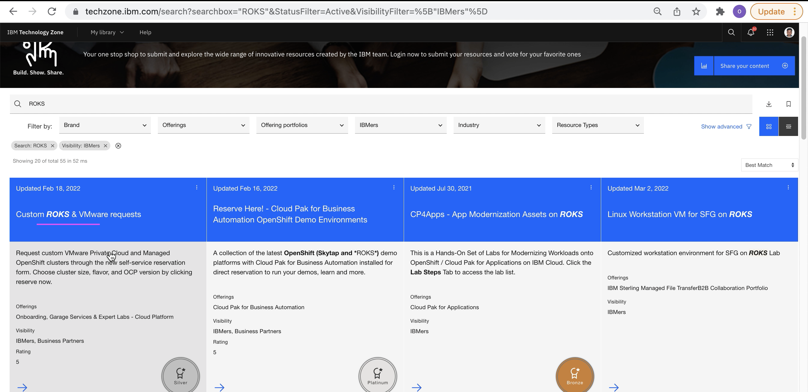
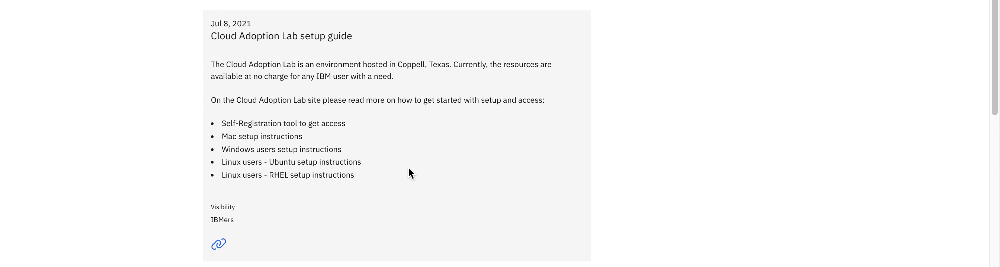
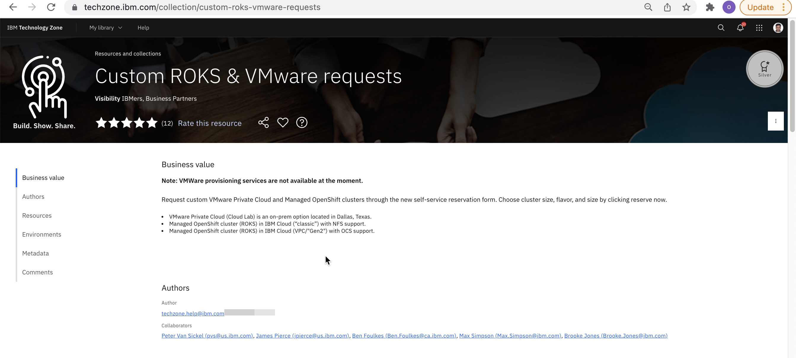
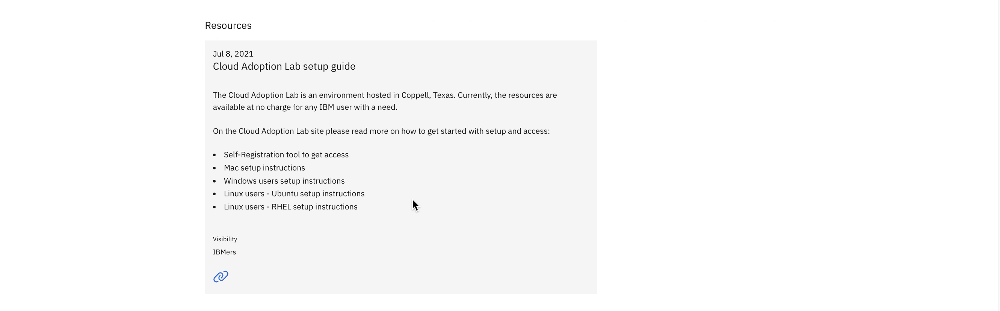
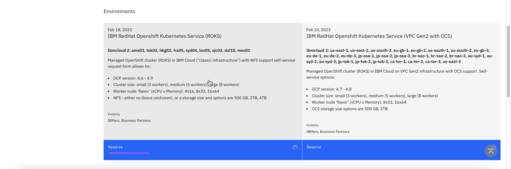

## 3. Create Reservation

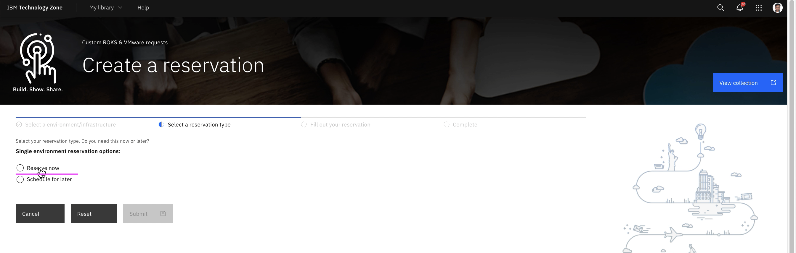
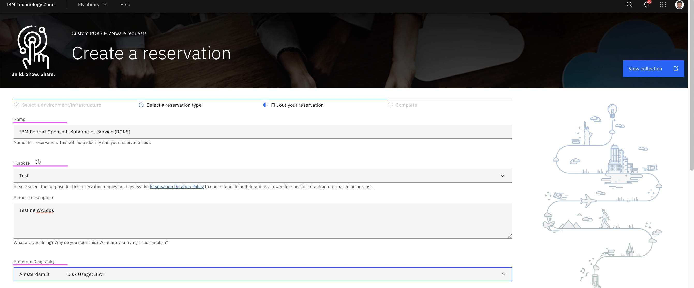
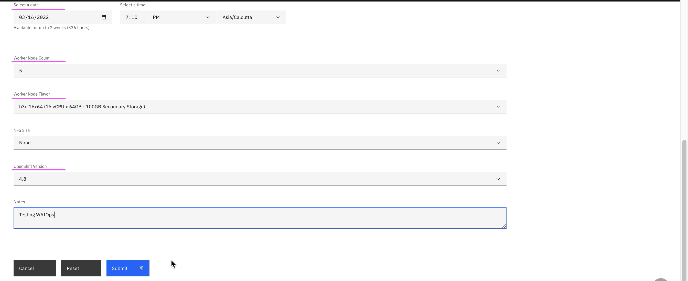
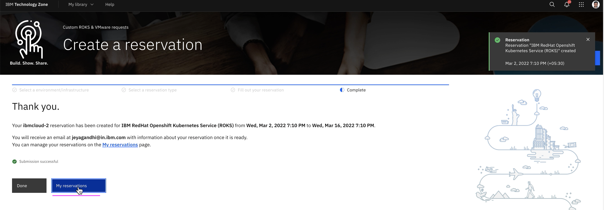

## 3. Access Cluster

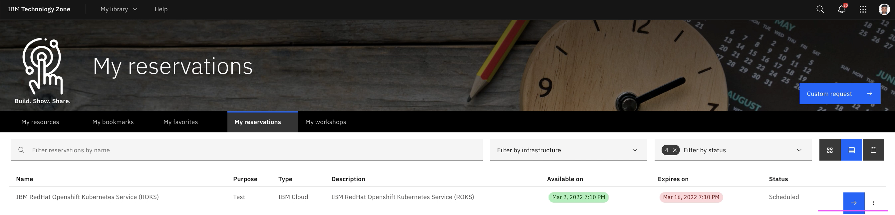
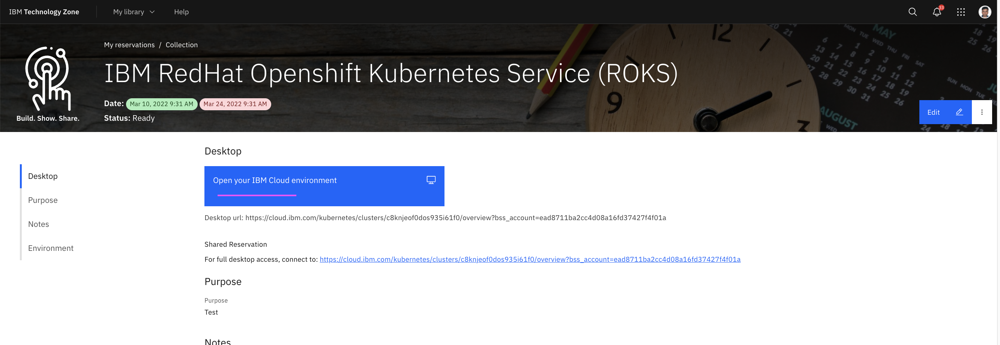
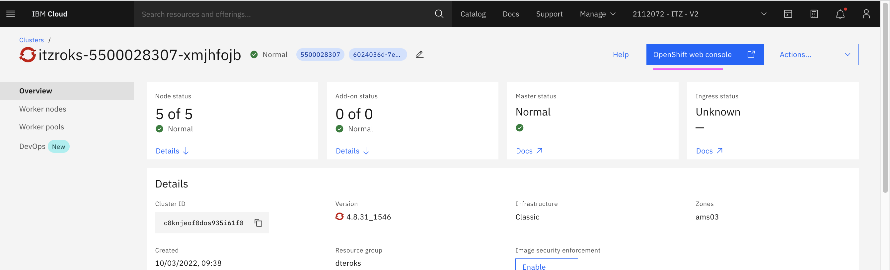
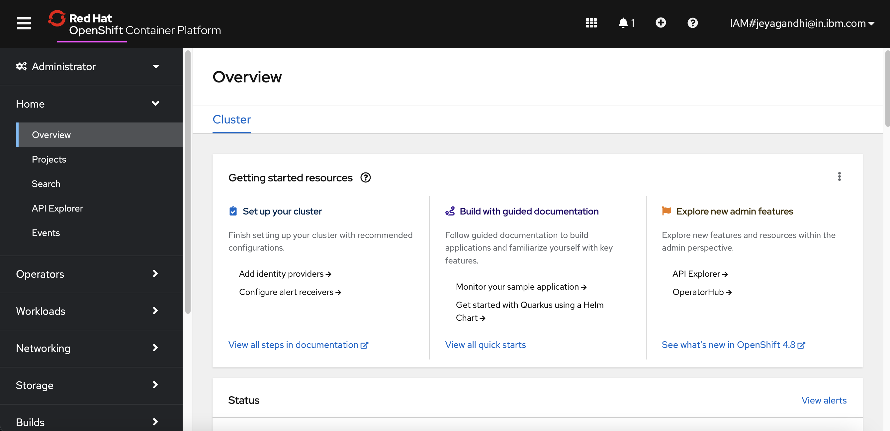

